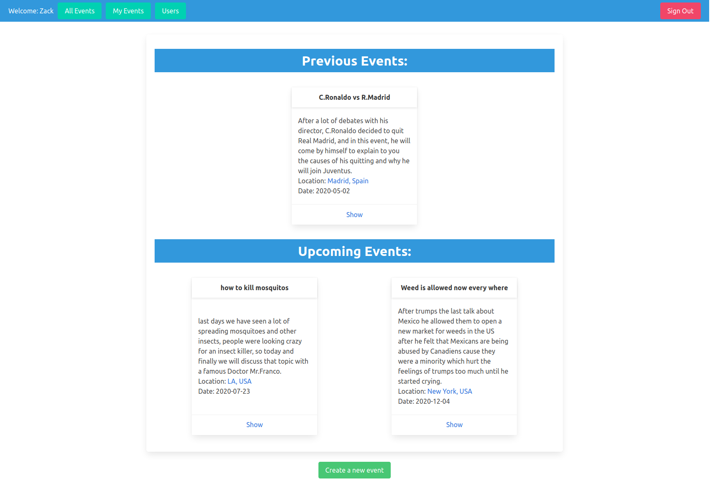

# Micro Reddit

>  Private Events is a task from the odin https://www.theodinproject.com/courses/ruby-on-rails/lessons/associations

## Built With

- Ruby 2.6.5
- Rails 6.0.3
- Capybara, Rspec 

## Live View

## Screenshot
-  

## Authors

👤 **Zakariae El Mejdki**

- Github: [@elmejdki](https://github.com/elmejdki)
- Twitter: [@zakariae_elmejdki](https://www.linkedin.com/in/zakariaeelmejdki)
- Linkedin: [elmejdki zakariae](https://twitter.com/zakariaemejdki)

👤 **Franco Rosa**

- Github: [@Franco Rosa](https://github.com/FrancoRosa)
- Linkedin: [Franco Rosa](https://www.linkedin.com/in/franco-rosa-79972119b/)

## 🤝 Contributing

Contributions, issues and feature requests are welcome!

Feel free to check the [issues page](https://github.com/elmejdki/TubeClone/issues).

## Show your support

Give a ⭐️ if you like this project!

## Acknowledgments

a big hat to me and my partner Zakariae El Mejdki and anyone who help us either by openning issues on this repository or reviewing our code :)

## 📝 License

This project is [MIT](lic.url) licensed.
